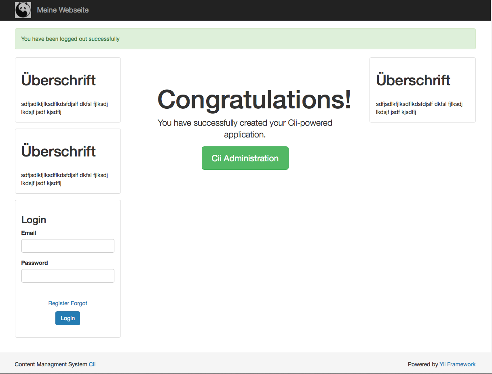
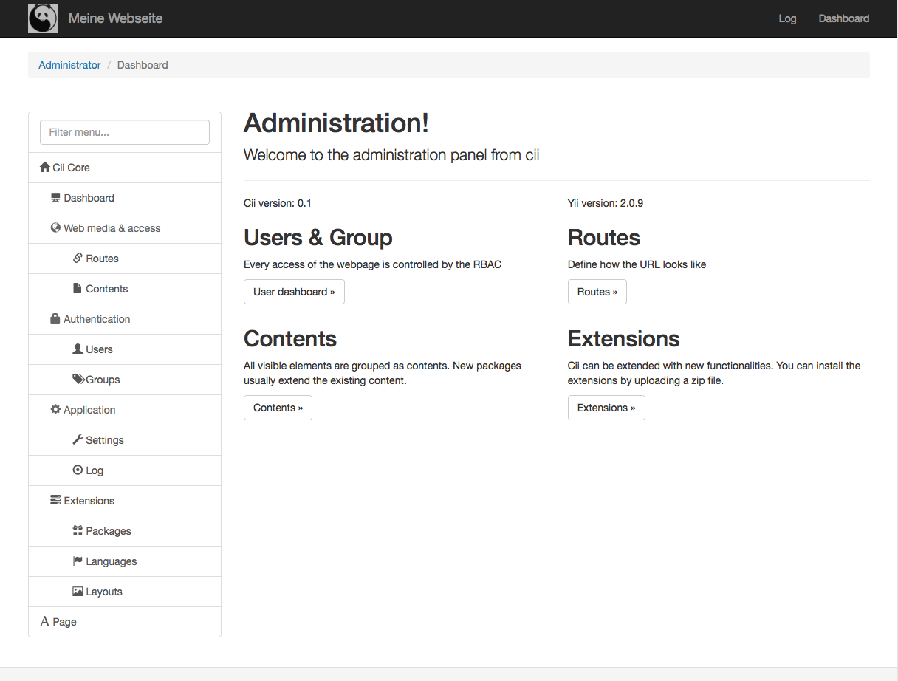
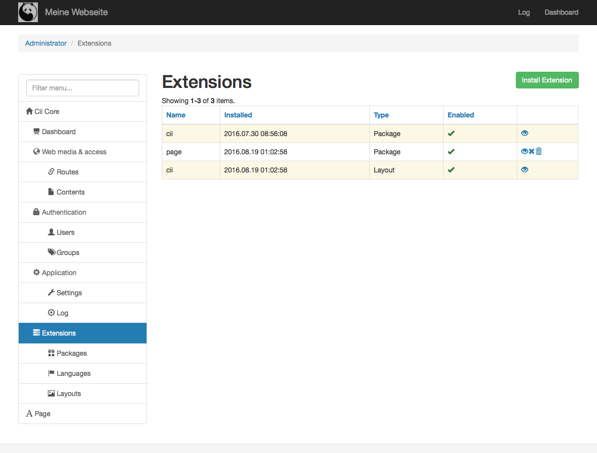
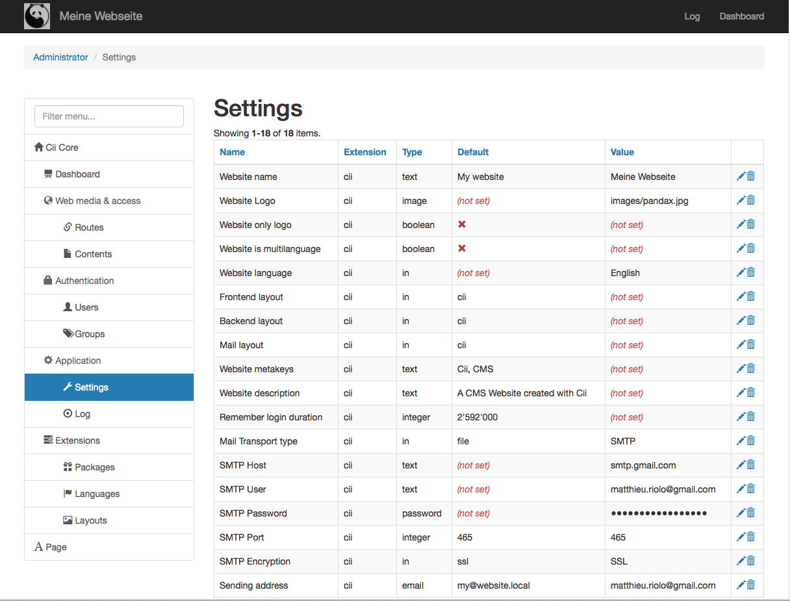
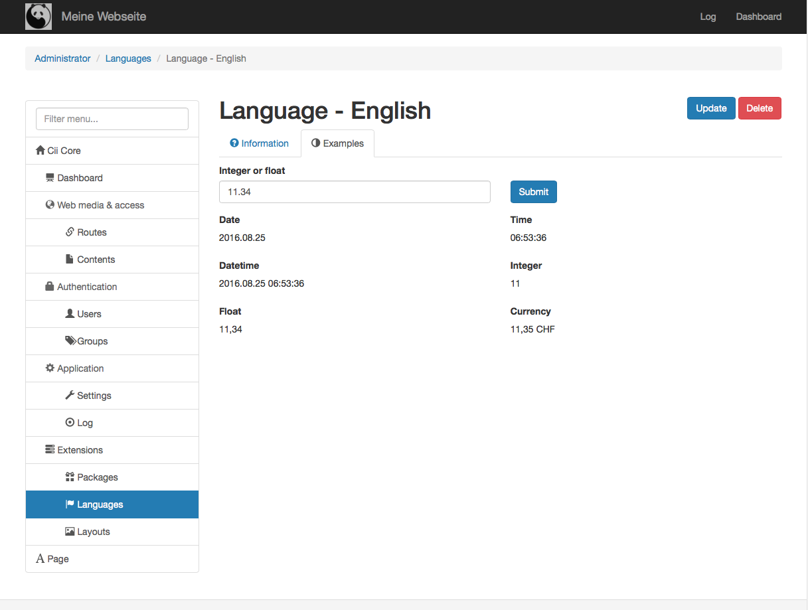
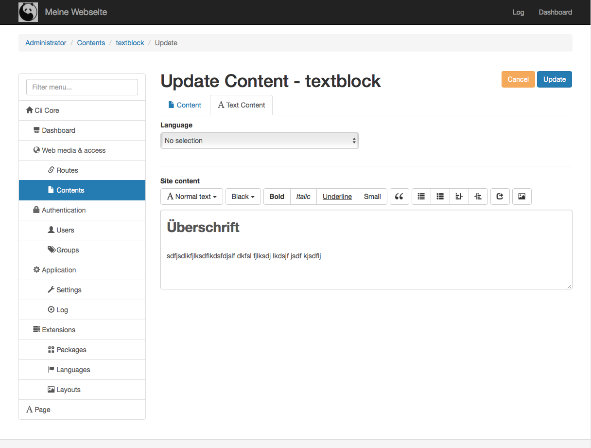

# Cii
A PHP CMS based on Yii 2 inspired by joomla.

Cii provides an extendable systems for routes and contents. Cii has a basic user&group system and a module installer. The website can be configured with a web installer as well.

# Version
This project is still in early development phase!! Not recommanded to use in productive environment

# Yii 2
The original code of yii 2 has a few changes. Those changes will be provided with a patch in the future. The biggest change is that the vendor folder is placed inside the module cii

# Features
- Web installer (init and extensions)
- User management based on groups and permissions per Module
- Type based setting managment
- Extensions (Modules, Languages, Layouts)
- Extendable basic object (routes and contents)
- Gii support
- MySQL to migrate
- Backup functionality
- Integrated file browser
- Log functionality (Default for mail, thumbnails, sql and common application failures)

# Screenshots

